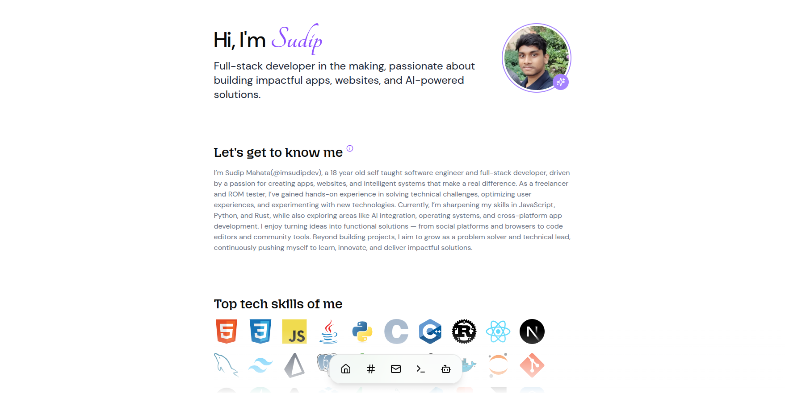

# 🚀 imsudipdev — Developer Portfolio (v0.4.0)

A modern, multi-mode developer portfolio that blends **GUI**, **AI**, and **CLI** experiences, all in one interface.  
It’s not just a personal site, it’s an **interactive workspace** that reflects how I think, build, and create.

> 🧠 “Because a developer’s portfolio should feel as dynamic as their code.”

---

## 🧩 Overview

This is my **personal portfolio**, reimagined as a hybrid platform:

- 🖥️ **GUI Mode** — a minimal, fast, and elegant interface showcasing my journey, projects, and work.
- 💬 **AI Mode** — an embedded AI assistant trained on my style and content — ask it anything about me, my projects, or tech.
- 💻 **CLI Mode** — a fully functional web terminal that lets you explore my portfolio using commands like `help`, `projects`, `skills`, etc.

It’s part website, part AI companion, and part developer tool — built from scratch to be as _personal_ as it is _functional_.

---

## ⚡ Features

- 🧠 **AI Integration** — chat with an AI trained on my developer profile & projects.
- 💻 **Web Terminal (CLI)** — simulate a real shell and explore my portfolio via typed commands.
- 🖥️ **Responsive GUI** — minimal UI for quick visual browsing.
- 🧩 **Command Parser** — custom-built system that handles aliases (`help`, `h`, `?`) and contextual outputs.
- 🌗 **Light/Dark Terminal Theme** toggle.
- 🧠 **Auto Scroll + Session History** like a real terminal.
- 🔗 **Clickable links** inside CLI responses (projects, socials, contact).
- 🪶 **Type-safe & modular architecture** written entirely in **React + TypeScript**.

---

## 🛠️ Tech Stack

| Category           | Tools                          |
| ------------------ | ------------------------------ |
| **Frontend**       | React, TypeScript, TailwindCSS |
| **Build Tool**     | Vite                           |
| **AI Integration** | OpenAI / LangChain.js          |
| **UI Elements**    | Framer Motion, React Icons     |
| **State Handling** | React Hooks                    |
| **Hosting**        | Vercel                         |

---

## 🧠 Available CLI Commands

| Command    | Aliases   | Description                     |
| ---------- | --------- | ------------------------------- |
| `help`     | `h`, `?`  | Show all available commands     |
| `about`    | `whoami`  | Display info about me           |
| `skills`   | `s`       | List my technical skills        |
| `projects` | `p`, `ls` | Show featured projects          |
| `edu`      | `e`       | Display education background    |
| `social`   | `links`   | Show social media profiles      |
| `contact`  | `mail`    | Show contact information        |
| `theme`    | `t`       | Toggle light/dark terminal mode |
| `version`  | `v`       | Display portfolio version       |
| `exit`     | `quit`    | End CLI session                 |

---

## 🌐 Live Demo

👉 **[imsudip.is-a.dev](https://imsudip.is-a.dev)**

---

## 🧑‍💻 About Me

I’m **Sudip Mahata (@imsudipdev)** —  
an 18-year-old self-taught software engineer, full-stack developer, and creative builder.

I love building things that combine **design, logic, and intelligence** — from apps and systems to developer tools and AI integrations.  
My stack revolves around **JavaScript, Python, and Rust**, and I’m constantly experimenting with AI, OS design, and cross-platform dev.
